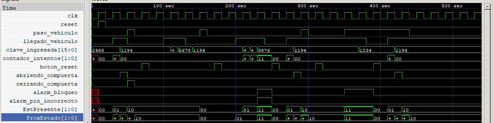

# Proyecto de Control de Acceso

Este proyecto implementa un sistema de control de acceso utilizando Verilog. El sistema incluye un módulo de control de acceso, un probador y un banco de pruebas. A continuación se describen los archivos y cómo utilizarlos.

## Autor
Mario Enrique Brenes Arroyo (Carné C11194)  
Estudiante de la Universidad de Costa Rica (UCR), Segundo Semestre 2024.

## Archivos del Proyecto

- **`control_de_acceso.v`**: Implementa el módulo de control de acceso.
- **`tester.v`**: Contiene el probador para el módulo de control de acceso.
- **`testbench.v`**: Incluye el banco de pruebas para verificar el funcionamiento del sistema.

## Requisitos

- **Icarus Verilog** (`iverilog`): Compilador de Verilog.
- **VVP**: Simulador de Verilog.
- **GTKWave**: Visualizador de formas de onda.

## Pruebas del sistema
1. Prueba #1, funcionamiento normal básico. Llegada de un vehículo, ingreso del pin correcto 
y apertura de puerta, sensor de fin de entrada y cierre de compuerta. 
2. Prueba #2, ingreso de pin incorrecto menos de 3 veces. Llegada de un vehículo, ingreso de 
pin incorrecto (una o dos veces), puerta permanece cerrada.  Ingreso de pin correcto, 
funcionamiento normal básico.  Revisión de contador de intentos incorrectos. 
3. Prueba #3, ingreso de pin incorrecto 3 o más veces. Revisión de alarma de pin incorrecto.  
Revisión de contador de intentos incorrectos.  Ingreso de pin correcto, funcionamiento 
normal básico. Revisión de limpieza de contadores y alarmas. 
4. Prueba #4, alarma de bloqueo. Ambos sensores encienden al mismo tiempo, encendido de 
alarma de bloqueo, ingreso de clave incorrecta, bloqueo permanece.  Ingreso de clave 
correcta, desbloqueo.  Funcionamiento normal básico.
## Uso del Makefile

El Makefile incluido en este proyecto permite compilar y ejecutar los archivos Verilog de manera sencilla. A continuación se describen los comandos disponibles:

### Compilar y Ejecutar la Simulación

Para compilar los archivos Verilog y ejecutar la simulación, utiliza el siguiente comando:

```bash
make run
```
Este comando realiza las siguientes acciones:

Compila los archivos control_de_acceso.v, tester.v y testbench.v.
Ejecuta la simulación utilizando vvp.
Abre el archivo de resultados resultados.vcd con GTKWave para visualizar las señales.


### Eliminar archivos sobrantes despues de haberlo ejecutado
```bash
make clean
```

Este comando elimina los archivos de salida generados (a_tb, b_tb, c_tb, acceso_tb.vvp y resultado.vcd).


### Por favor seguir este orden cuando haga make run y esté dentro de GTKwave




